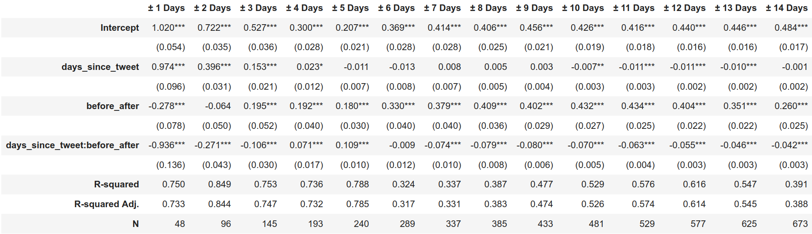
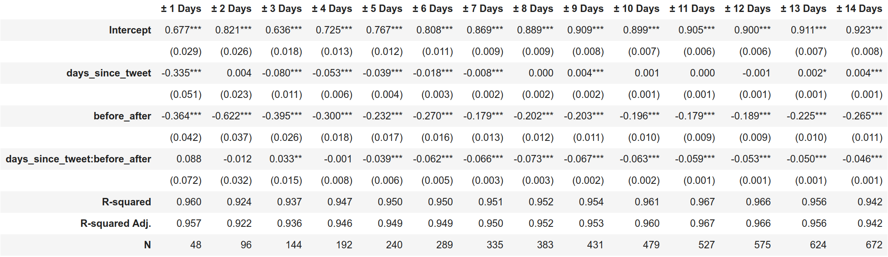
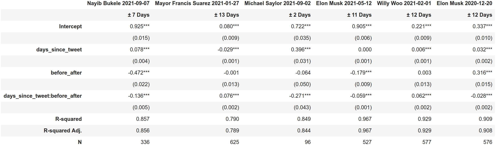
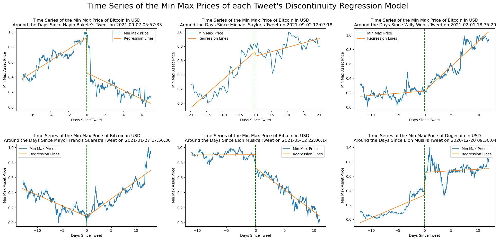
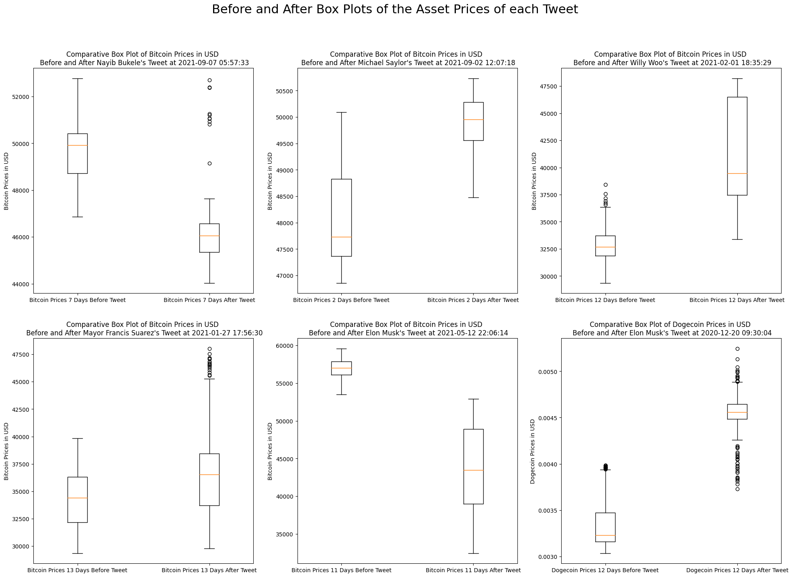
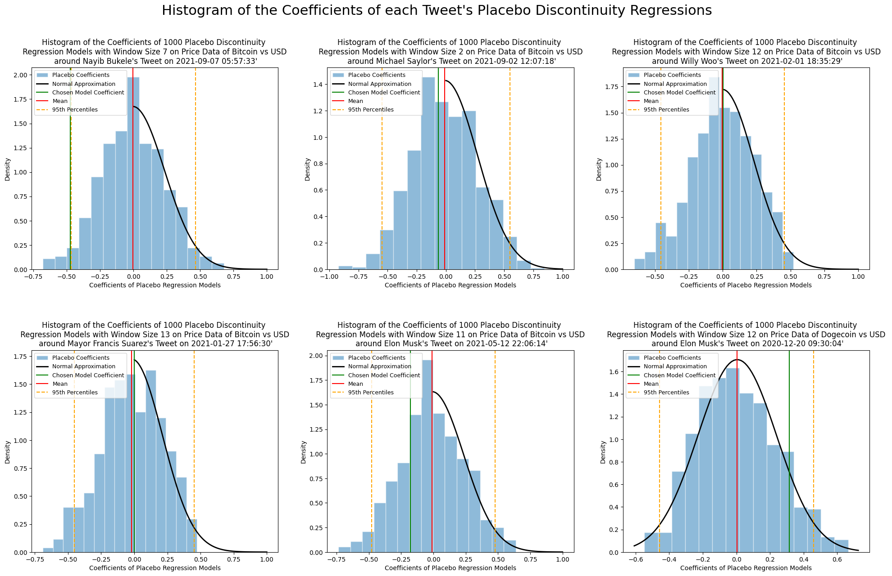

# Establishing Causal Relationships between Influential Tweets and Cryptocurrency Prices using Regression Discontinuity.

All source code available on [Github](https://github.com/DataTa-Da/qm2).

## Background & Context: What is the trend regarding blockchain and cryptocurrencies?

Since 2019, blockchain technology has catalysed the public’s interest and
curiosity. In a nutshell, a blockchain is a distributed database shared among
the nodes of a computer network (Hayes, 2022). Regarded as maintaining a secure
and decentralised record of transactions, it offers new trust alternatives in
many domains such as the Art authentication market (“Blockchain Art Collective,”
n.d.). In the financial sector, blockchain has a tremendous popularity as it
enabled the emergence of what is called: cryptocurrency.

As its name suggests, cryptocurrencies are digital currencies making use of 
blockchain encryption systems to generate fiduciary trust (Frankenfield, 2022).
We regularly hear people sharing positive and negative opinions about
cryptocurrencies on social media (Twitter, Facebook, Discord, Instagram, Reddit,
etc.). Whether it comes to discussing the underlying philosophy and theory of
such an invention or simply debating the potential benefits of trading this
asset class, it seems like the market behaves very responsively to the
information being given by highly followed individuals (Shahzad, Anas, & Bouri,
2022). No matter the truth of their statement, they appear to have significant
power on coins’ price, endangering market efficiency and legitimacy.

## Literature review and project overview: Where does our research stand in the field?

Research has previously been conducted in Behavioural Economics to study how the
emotional intelligence of cryptocurrency buyers and investors expressed on
social media can be used to forecast the value of specific coins. It was shown
that algorithmic trading models fed with Twitter data can, to a satisfying
degree of confidence, predict the value of Bitcoin, Bitcoin Cash, and Litecoin
(Kraaijeveld & De Smedt, 2020). Additionally, some studies have focused on
analysing the effect of tweets from politicians like Donald Trump on the Bitcoin
(Huynh, 2021) and the equity markets (Klaus and Koser, 2021). 

Our research builds on Shahzad, Anas, and Bouri study on the impact of Elon 
Musk’s tweets on Bitcoin and Dogecoin (Shahzad, Anas, & Bouri, 2022) by
extrapolating their work on two important strands of research. On the one hand,
we look at crashes, bubbles, and volatility.  On the other hand, we deal with
social media impact on tradable asset markets. Concretely, we extend the scope
of some previous event-based studies to investigate the eventual causal
relationships between tweets and cryptocurrencies’ price, aiming to quantify our
intuition that price fluctuations can be the result of influential individuals’
tweets about the topic.

## Group objectives: Why and what for?

###   Short-term objective

We aim to understand the interactions between Twitter, influential individuals,
and the cryptocurrency market from the prism of Data Science, and Statistics.
Establishing causal relationships between tweets and cryptocurrencies’ price
fluctuation would give us insights which could then be interpreted
qualitatively. In such a scenario, we would then be able to generalise previous
research and build a revised investment thesis, opening perspectives on social
media&rsquo;s role in the Economy’s efficiency.

### Long-term objective (Not covered in this paper)

Provided that we find causality, we would be interested in enhancing the current
algorithmic trading models, which use community sentiment analysis to predict
the value of several coins. If it appears that a significant number of price
fluctuations are triggered by a small group of people, then, quantifying their
sentiment and behaviour on Twitter, we would be able to predict to a satisfying
degree of confidence, over short durations, the apparition of bubbles and
crashes. After proof of concept, this model could be used as a tool in
investors’ decision-making process.

## Data and Methodology

We began by selecting a small sample of tweets mentioning crypto currencies that
were &ldquo;influential&rdquo; or &ldquo;important&rdquo; enough to potentially impact an asset&rsquo;s price.
Given there is no objective metric of a tweet&rsquo;s significance, we relied on
selecting tweets that were deemed important enough to be picked up by news
publications in the crypto space. In particular, we picked out 6 tweets from
[Crypto Twitter year in review: 10 influential tweets of 2021](https://cointelegraph.com/news/crypto-twitter-year-in-review-10-influential-tweets-of-2021) that explicitly
mentioned a specific asset.

Using these, we created six datasets, one for each tweet - five of which on
Bitcoin and one on Dogecoin. These included the hourly prices in USD of each
asset 315 days before and after a tweet&rsquo;s creation, yielding a total of just
over 15100 observations per dataset.

Specific asset prices were pulled from Coingecko&rsquo;s free, publically available
API, once the official timestamp of each tweet&rsquo;s creation was acquired through
Twitter&rsquo;s API with the Tweet Lookup endpoint.

The same quantitative analysis was then performed on each dataset.

### Sharp Regression Discontinuity and Bandwidth Selection

The time of a tweet&rsquo;s creation was treated as a treatment effect on the asset
price that it mentioned, enabling a Sharp Regression Discontinuity to be used as
a test of causal inference between a specific tweet and asset. The form of the
regression model is given by:

$$
Y_{i} = \beta_{0} + \beta_{1} X_{i} + \beta_{2}D_{i} + \epsilon_{i} \\
$$

$$
D_{i} = \begin{cases}
        &1 \quad X_{i} > X_{k} \\
        &0 \quad X_{i} < X_{k}
        \end{cases}
$$

where $Y_i$ is the min max normalization of a cryptocurrency&rsquo;s price at a given
time $i$, and where $X_{i}$ is the number of days since the tweet (before or
after) for that same time $i$. Hence, the variable $D_{i}$ denotes whether at
time $i$ we are before or after the tweet&rsquo;s creation time - taking on a value of
1 for after, and 0 for before. The coefficients $\beta_{0}$,$\beta_{1}$ and
$\beta_{2}$, as well as the error term $\epsilon_{i}$ were all estimated with ordinary
least squares.

In order to improve the robustness of the discontinuity models, as well as to
find an appropriate bandwidth to perform them on, an individual, ad hoc approach
was taken to bandwidth selection that involved estimating the same model for a
given tweet at varying time intervals, from ±1 day to ±14 days. The final
bandwidth for a given tweet was then selected based on the change of the
R-Squared and Standard Errors across its models, where higher values of the
former and lower ones of the latter were prioritised. Line plots of the
predictions of candidate models were also produced in order to ensure the
finalised one made qualitative sense.

### Before/After Box Plots

Once the model bandwidth finalised, comparative box plots of the asset prices
within the bandwidth were produced - one box plot for the prices before treatment
and another for after it. This way, summary statistics of the values before and
after the tweet could be easily compared.

### Placebo Tests (Falsification Checks)

A thousand Placebo Tests of each tweet&rsquo;s finalised model were performed at
random times along their respective datasets of historical price data. In
practice, for a given tweet and model, this involved randomly selecting a date
and time within the tweet&rsquo;s dataset to be used as the moment of creation of a
fake tweet. The exact same discontinuity regression was then performed across
the same finalised bandwidth, but centered around this fake tweet&rsquo;s date and
time instead. All of which was repeated a thousand times for reliability.

In the process of performing these placebo models, the coefficient $\beta_{2}$
of the discrete, before and after variable $D_{i}$, was logged at each
iteration. Histograms were then produced to visualise the distribution of these
coefficients, with normal distributions being fitted whenever appropriate.

## Results and Discussion

### Regression Discontinuity Models

All the parameters of the finalised models of each tweet are listed in [Table 3](#tbl3).
Importantly, not all models were performed on the same sized bandwidth. Some
interval ranges better captured the trend of their asset&rsquo;s price around the
cutoff than others. In part due to the natural volatility of crypto currencies
and the unpredictability of when other confounding factors might dramatically
affect the price of the asset. Which is to say that shorter intervals may work
better in some cases because the behaviour of an asset&rsquo;s price in a longer term
may be so erratic as to undermine the ability of the model to capture any
semblance of a trend around the cutoff if included [Table 1](#tbl1). Conversely, larger
bandwidths may be more appropriate in other cases when short term volatility of
the price around the cutoff offers not semblance of what the actual impact of
the tweet might be [Table 2](#tbl2). In both cases, we run the risk of moving
forward with a model that misrepresents the actual behaviour around the time of
a tweet&rsquo;s creation.

Table 1: Table of Model Parameters for Regression Discontinuity Models of Varying Bandwidth Size on Michael Saylor&rsquo;s 2021-09-02 Tweet on Bitcoin.

Table 2: Table of Model Parameters for Regression Discontinuity Models of Varying Bandwidth Size on Elon Musk&rsquo;s 2021-05-12 Tweet on Bitcoin.

The regression parameters of each tweets are summarised in [Table 3](#tbl3), where
`before_after` is the discrete variable $D_{i}$ we are concerned with. This
coefficient&rsquo;s significance however, is better appreciated in the line plot of
each models&rsquo; predictions [Figure 1](#fig1).

Table 3: Table of Model Parameters of Each Tweet&rsquo;s Finalised Regression Discontinuity Model.

Figure 1: Collection of Time Series Plots of Each Model&rsquo;s Min-Max Normalized Prices and Model Predictions.

We discover that the six 6 tweets fall into 2 separate cases: some assets
experience a shock near the cutoff while others experience a more gradual, if at
all. In the case of asset&rsquo;s that experience shocks, like Nayib Bukele&rsquo;s tweet
for example, the Regression Discontinuity model offers a reliable estimate of
the impact a tweet might have on a cryptocurrency&rsquo;s price. Bukele&rsquo;s model
suggests, with both significance and confidence [Table 3](#tbl3), that his tweet caused a
0.472 **decrease** in Bitcoin&rsquo;s price. Likewise, Elon Musk&rsquo;s tweets mentioning
Bitcoin and Dogecoin have each impacted their cryptocurrency&rsquo;s price, causing a
0.179 decrease and 0.316 increase respectively [Table 3](#tbl3). Again, with both significance and
confidence.

However, other tweets like those of Mayor Francis Suarez and Willy Woo
experience no sudden shocks in price, only gradual, more long term changes in
trend. Each tweet&rsquo;s model reflects this in the near 0 coefficients [Table 3](#tbl3) of the
discrete `before_after` variable ($D_{2}$). As a result, no quantitative argument
can be made that their tweets played any role in the subsequent changes in asset
price. Especially when instances like Michael Saylor&rsquo;s model share similar model
parameters but with an asset price that doesn&rsquo;t experience any kind of trending
change post-tweet. That is to say that from the perspective of Regression
Discontinuity, Mayor Francis and Willy Woo&rsquo;s fall into the same category as
those of Michael Saylor, in spite of any kind of trend in price after the cutoff.

### Box Plots

The various box plots of each tweet&rsquo;s cryptocurrency prices, in the context of
their model, are layed out in [Figure 2](#fig2). When taken alongside [Figure 1](#fig1)
it&rsquo;s clear that the summary statistics offered by the box plots do little other
than reiterate the point that each asset price experienced a significant change
before and after the tweet, with only Mayor Francis Suarez proving to be more of an
exemption. In all other cases, the interquartile ranges of the before and after
plots don&rsquo;t even overlap.

Figure 2: Collection of Box Plots of the Asset Price of Each Tweet&rsquo;s Cryptocurrency Before and After the Tweet, within the Tweet&rsquo;s Finalised Model&rsquo;s Bandwidth

Nevertheless, the plots highlight an important point - these stark differences
in the distribution and central tendencies of asset prices can be misleading
without the results of the previous regression models. Taken alone, these
summary statistics have no real way of differentiating between assets that
experience sudden shocks after specific tweets, and those that experience more
gradual changes, as previously touched on.

### Placebo Tests

In conducting Placebo Tests we wanted to get any idea for the distribution of
`before_after` ($D_{2}$) coefficients if our tweets&rsquo; models were performed at
random points along their assets&rsquo; prices. Doing so resulted in the normally
distributed values shown in [Figure 3](#fig3).

The first thing to note is that not all the normal distributions are the same,
particularly in the range of coefficients they extend over. Take Willy Woo and
Michael Saylor&rsquo;s histograms as examples [Figure 3](#fig3). This places into context
the value of the coefficients of each finalised model. Nayib Bukele&rsquo;s 0.472 [Table 3](#tbl3)
decrease is a more extreme result in the context of its own associated
histogram, than it would be in Michael Saylor&rsquo;s or Elon Musk&rsquo;s (Bitcoin) one.

Figure 3: Collection of Histograms of the Coefficients of Each Tweet&rsquo;s 1000 Placebo Tests.

Regardless, the fact that the coefficients of randomly performed models are
normally distributed over a large range of values does little to actually
falsify our original results. Only Nayib Bukele&rsquo;s finalised coefficient breaches
the 95% percentile of its histograms normal approximation [Figure 3](#fig3). But this
only suggests that finding such a high (negative) coefficient with Sharp
Regression Discontinuity is unlikely at other points in time along Bitcoin&rsquo;s
price. What it doesn&rsquo;t show is whether we can have any greater confidence in the
argument that Bukele&rsquo;s tweet **caused** the sudden decrease in price.

Put differently, in the context of tweets that were shown to have some
significant impact on their asset&rsquo;s price [Table 3](#tbl3), that is - those with
coefficients other than 0, these histograms are simply showing how likely one
would have achieved those same coefficients by evaluating the exact same models
at random points in time. Under these placebo tests, all we learn is that larger
coefficients for the discrete variable are more unlikely to randomly occur. And
to use them as a sign of confidence in the argument that a tweet caused a
change in price would imply that there is more confidence to be had in assets
that experience larger jumps in price, around the time of a particular tweet,
than those that experience smaller jumps. From a qualitative perspective, this
makes little sense given the size of the shock an asset may experience should be
independent of its causal relationship with a potential tweet.

With that said, in the case of regression models like those of Willy woo,
Michael Saylor and Mayor Francis Suarez, their normal distributions of random
coefficients further support the argument that their respective tweets **didn&rsquo;t**
cause their assets to experience any kind of shock. In all their cases, the mean
of their random coefficients also hovers around 0, suggesting that the behaviour
of their respective assets&rsquo; price around their cutoffs is well within expected
behaviour.

## Conclusions, Implications and Future Research

Although Sharp Regression Discontinuity can detect and quantify the shocks
cryptocurrencies may experience at given points in time, it does little to
establish any kind of reliable causal inference between a specific tweet and the
asset it mentions. Particularly because falsification strategies like Placebo
Tests fail.

However, this is in part due to the nature of the underlying data. The rather
extreme volatility of cryptocurrencies leave them predisposed to experiencing
shocks. As a result, as placebo tests are performed to check that no similar
jumps exist along random points of an asset&rsquo;s price history, these tests are
bound to stumble across other shocks.

This is to say that price data of this kind doesn&rsquo;t lend itself to these
kind of discontinuity methods. A variable that has a propensity for experiencing
shocks offers little recourse to Sharp Regression Discontinuity in providing a
conclusive answer to the causal relationship between a independent and treatment
variable.

Attempts were made to try and mitigate this by evaluating the regression models
on price data smoothed using a Hordick-Prescott (HP) filter. But this was found
to produce little effect. Likewise, weighted regressions were tested that used
both straight line and Gaussian kernel weightings. Again, with little effect.
Asymmetric bandwidths were also tried, which involved performing models on
windows of time that had more days before the tweet than afterwards, with little
avail.

Going forward, unless other methods can be joined with Sharp Discontinuity
Regression to compensate for the underlying properties of cryptocurrency price
data, then new quantitative approaches need to be taken to establishing causal
relationships between tweets and cryptocurrency performance.

## Bibliography

Blockchain Art Collective. (n.d.). Retrieved from Blockchain Art Collective
website: <https://blockchainartcollective.com/CRYPTOCURRENCY> | meaning in the
(2022, September 27). Blockchain Explained. Retrieved from Investopedia website:
<https://www.investopedia.com/terms/b/blockchain.aspKraaijeveld>, O., & De
Frankenfield, J. (2022, May 28). Cryptocurrency. Retrieved from Investopedia website: https://www.investopedia.com/terms/c/cryptocurrency.aspSmedt, J. (2020). The predictive power of public Twitter sentiment for
forecasting cryptocurrency prices. Journal of International Financial Markets,
Institutions and Money, 65, 101188.
<https://doi.org/10.1016/j.intfin.2020.101188Shahzad>, S. J. H., Anas, M., &
Bouri, E. (2022). Price explosiveness in cryptocurrencies and Elon Musk’s
tweets. Finance Research Letters, 102695.
<https://doi.org/10.1016/j.frl.2022.102695>

